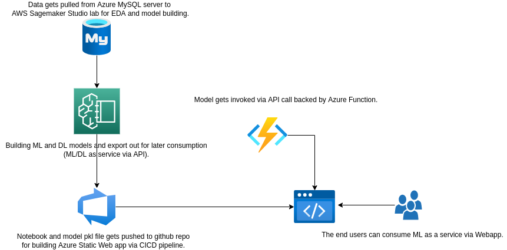

# MLOps Workflow
## 1. Introduction
### 1.1	Overview

This MLOps workflow covering Deep Learning model prediction written with Tensorflow is intended to be used as a reference for other developers. The workflow is based on the following:
- DL Notebooks: A set of notebooks for Deep Learning model prediction
- DL Models: A set of models for Deep Learning model prediction
- Data preprocessor: SKlearn pipeline for data preprocessing
- Azure Static Web Apps
- Azure Functions
- Github Actions (CICD pipeline)
- Github Codespace (devcontainer & Dockerfile)

## 2 Logical Architecture
### 2.1	Logical System Component Overview

- Data gets pulled from Azure MySQL server to AWS Sagemaker Studio lab for EDA and model building.
- Building ML and DL models and export out for later consumption (ML/DL as service via API).
- Notebook and model pkl file gets pushed to github repo for building Azure Static Web app via CICD pipeline.
- [DL Notebooks](https://github.com/lyoh001/DLInsurance/blob/main/notebook/notebook.ipynb) 
- Model gets invoked via API call backed by Azure Function.
- The end users can consume ML as a service via Webapp.

## 3 Power BI Dashboard for Visualization

## 4 Azure Static Web App for ML Prediction Demo
Ref: [DL](https://gentle-smoke-0b89c3c10.1.azurestaticapps.net/)

## 5 MSDocs Link
Ref: [MSDocs](https://docs.microsoft.com/en-us/azure/static-web-apps/functions-bring-your-own/)